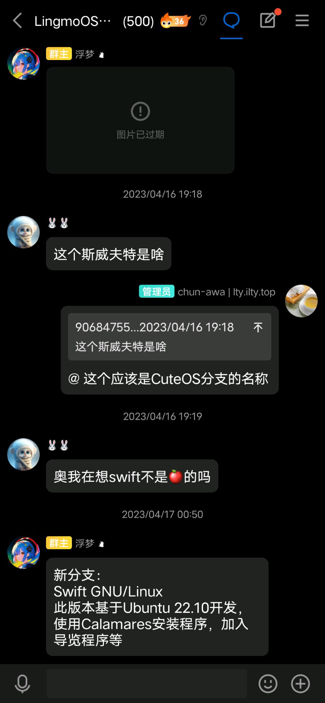

# History of LingmoOS

## 2023-02-05
CuteOS(based on Ubuntu) released: <https://www.bilibili.com/video/BV1Nd4y1H7ZW>

## 2023-03-05
chun-awa joined in the LingmoOS QQ Group

## 2023-04-16
Changed project name to SwiftOS

## 2023-*unknown*
SwiftOS 6.05.1 released: <https://cloud.189.cn/web/share?code=QJbIvyzAjuie> (password:9imq)

## 2023-05-27
Changed project name to LingmoOS

## 2023-*unknown*
LingmoOS 1.0.6 released (source: <https://bbs.lingmo.org/d/4-1xban-ben-de-yi-ge-xiao-wen-ti>)

## 2023-11-28
Started [LingmoOS Community](https://bbs.lingmo.org/)

## 2023-12-29
Elysia joined in the LingmoOS community

## 2024-01-27
LingmoOS Polaris beta released: <https://sourceforge.net/projects/lingmo-os/files/release/iso/polaris/beta/>

## 2024-01-29
LingmoOS Polaris beta3 released: <https://sourceforge.net/projects/lingmo-os/files/release/iso/polaris/beta3/>

## 2024-02-09
Aninana joined in the LingmoOS community

## 2024-03-05
LingmoOS Polaris beta3.5 released: <https://sourceforge.net/projects/lingmo-os/files/release/iso/polaris/beta3.5/>

## 2024-03-19
Intro joined in the LingmoOS community

## 2024-03-22
LingmoOS Polaris beta3.5-dev released: <https://sourceforge.net/projects/lingmo-os/files/release/iso/polaris/beta3.5dev>

## 2024-03-25
Ported LingmoDE to Debian 13(trixie) arm64: <https://github.com/LingmoOS-Testing/lingmo-arm64-build>

## 2024-03-31
Ported LingmoDE to Debian 13(trixie) amd64: <https://github.com/LingmoOS-Testing/lingmo-amd64-build>

## 2024-04-13
We published a comprehensive statement about beta testing stage due to a incident ([Part 1](https://www.coolapk.com/feed/54577639?shareKey=YzdmNzUzM2IwODU2NjY1YWZmZDg) [Part 2](https://www.coolapk.com/feed/55107643?shareKey=ZDk2ZGY3MTQ1ZTI3NjY1YjAwZmY)) in the coolapk community:

<https://bbs.lingmo.org/blog/65-zong-he-sheng-ming>

<https://lingmoos.github.io/lingmo-documentation/docs/user_guides/intro#warning-lingmo-gnulinux-comes-with-absolutely-no-warranty-to-the-extent-permitted-by-applicable-law>

## 2024-04-15
LingmoOS Polaris beta3.6 released: <https://sourceforge.net/projects/lingmo-os/files/release/iso/polaris/beta3.6/>

Started LingmoOS Bug Tracker (source: <https://bbs.lingmo.org/blog/66-que-xian-gen-zong-xian-yi-shang-xian-bug-tracker-is-online>)

## 2024-04-25
Started to port LingmoDE to Alpine Linux: <https://github.com/LingmoOS-Testing/lingmo-alpine-apkbuilder/commit/dd650b8f7ce1b7e1059b941189ebc9418f780e5f>

## 2024-05-02
Started [LingmoOS Git Server](https://git.lingmo.org/)

## 2024-05-04
Started to port LingmoDE to Arch Linux: <https://github.com/LingmoOS-Testing/lingmo-arch-pkgbuilder/commit/9f7bd0c30a6949baacf440d8c5f08d676afcbf4b>

## 2024-05-11
Started to port LingmoOS to Arch Linux: <https://github.com/LingmoOS-Testing/lingmo-archiso-build/commit/635453d8a560495a7d43e873374e6a7021f77dc0>

## 2024-05-26
Snowball joined in the LingmoOS Development Team

## 2024-05-29
LingmoOS New Website: <https://testweb.lingmo.org>

## 2024-06-*unknown*
LingmoOS Git Server closed down
